# Voice of Octo: Architecture

Status: Phase 0 (audit and design) is done. The first platform code was built on 2026-10-01, ahead of the phase order, in `packages/engine`: the cascaded voice engine ([section 3.10](#310-voice-engine-v1-as-built)), the provider layer ([section 3.11](#311-provider-layer-v1-as-built)), the multi-tenant API foundation ([section 3.12](#312-identity-and-tenancy-v1-as-built)), the Assistant resource ([section 3.13](#313-assistant-resource-v1-as-built)), and the tool system ([section 3.14](#314-tool-system-v1-as-built)).
Last updated: 2026-10-02 (outbound campaigns, [section 3.21](#321-outbound-campaigns-v1-as-built); call analysis, [section 3.22](#322-call-analysis-and-transcripts-v1-as-built)).

This document has three parts:

1. [Current state](#1-current-state): how the existing Bangla voice assistant in this repo works today.
2. [Weaknesses and risks](#2-weaknesses-and-risks) found in the audit.
3. [Target architecture](#3-target-architecture) for the multi-tenant voice-agent platform, including the [data model](#4-core-data-model) and [tech choices](#5-tech-choices).

The reasoning behind each major choice, and the alternatives considered, are in [DECISIONS.md](DECISIONS.md). The phase plan is in [PROGRESS.md](PROGRESS.md). Security posture and remaining risks are tracked in [SECURITY.md](SECURITY.md).

---

## 1. Current state

The repo contains one product: a Bangladeshi Bangla voice assistant for a single deployment. It has user accounts, but no concept of organizations, assistants or phone calls.

### 1.1 Shape of the system

| Aspect | Today |
|---|---|
| Runtime | One Node.js process (Node 20+; tested locally on 24) |
| Backend | Express 4 + `ws`, all routes in [server.ts](../server.ts) (964 lines) plus helpers in [server/](../server/) |
| Frontend | Vite 6 + React 19 + Tailwind 4 SPA in [src/](../src/); served by the same Express process (Vite middleware in dev, `dist/` in prod) |
| AI providers | Google Gemini via `@google/genai` (realtime voice, LLM, transcription, TTS, embeddings, PDF extraction); ElevenLabs over REST (TTS, optional) |
| Storage | JSON files under `data/` (users, sessions, per-user documents and memories, shared documents, voice setting); in-process memory for the RAG index and reset tokens |
| Auth | Email + password (scrypt), session cookie `bn_session`, admins defined by the `ADMIN_EMAILS` env var |
| Tests | None for the legacy app. `npm run lint` runs `tsc --noEmit` only (passes as of this audit). Since 2026-10-01, `npm test` runs Vitest for `packages/engine` |
| Deployment | Render free web service, [render.yaml](../render.yaml); build `npm install && npm run build`, start `npm start`, health `/api/health` |
| Unused leftovers | `.venv/` (committed, about 4,165 files), [requirements.txt](../requirements.txt), [metadata.json](../metadata.json) mention a Python implementation that does not exist; `package.json` name is `react-example`; `bun.lock` alongside `package-lock.json` |

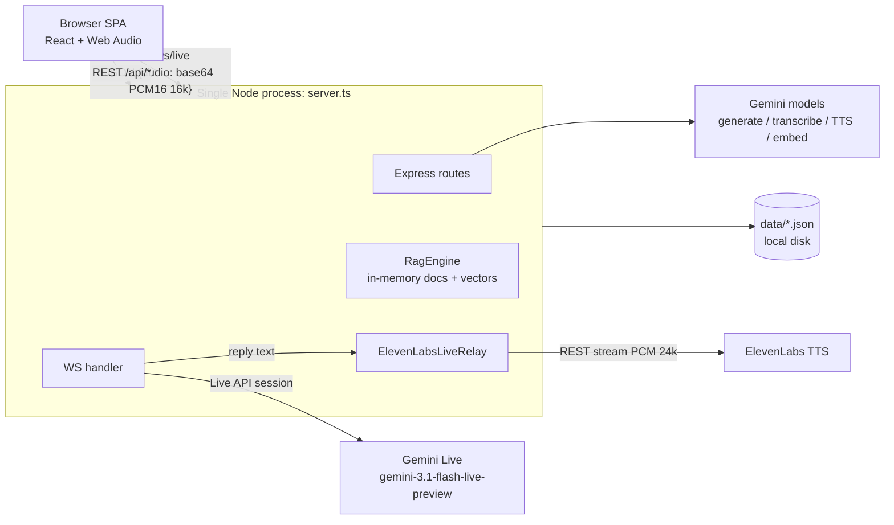

### 1.2 Entry points

| Entry | What it does |
|---|---|
| `npm run dev` → `tsx server.ts` | Starts Express on `PORT` (default 3100) with Vite middleware; if the port is busy it tries the next one |
| `npm run build` | `vite build` for the SPA, `esbuild` bundles `server.ts` to `dist/server.cjs` |
| `npm start` → `node dist/server.cjs` | Production server; serves `dist/` statically |
| [mictest.tmp.ts](../mictest.tmp.ts) | Manual script: synthesises a Bangla question with ElevenLabs, streams it with background noise into Gemini Live in real time for 60 s, and reports gaps and latency. Needs real API keys. This is an early version of the "simulations" module. |

HTTP endpoints (all in [server.ts](../server.ts)):

| Method and path | Auth | Purpose |
|---|---|---|
| `GET /api/health` | none | Status, whether a Gemini key is set, active TTS provider |
| `GET /api/auth/me`, `POST /api/auth/{register,login,logout,forgot-password,reset-password}` | varies | Account and session management |
| `GET /api/rag/documents` | user | Built-in reference documents |
| `GET /api/rag/custom-documents` | admin | Uploaded documents |
| `POST /api/rag/documents`, `DELETE /api/rag/documents/:id` | user | Add or delete a document (admins write to the shared pool) |
| `POST /api/rag/upload-file` | user | Base64 file in JSON body; PDF text extracted by Gemini (local regex extractor as fallback); summarised; indexed |
| `POST /api/transcribe` | user | Base64 audio → `gemini-3.5-transcribe` → text; also stores "voice memories" |
| `POST /api/tts` | user | Text → ElevenLabs MP3, or Gemini TTS WAV as fallback |
| `POST /api/rag/query` | user | Text question → LLM answer + inline TTS audio |
| `GET/PUT /api/admin/voice`, `POST /api/admin/voice/preview` | admin | Pick the ElevenLabs voice for all users |
| `WS /ws/live` | user (cookie) | Real-time voice session |

### 1.3 Real-time voice path (primary)

This is the path used when the user taps the voice button.

**Browser, audio in** ([src/App.tsx](../src/App.tsx) lines 232-332, [src/utils/audioUtils.ts](../src/utils/audioUtils.ts)):

1. `getUserMedia` at 16 kHz mono with echo cancellation and noise suppression on, automatic gain control off, `voiceIsolation` where supported.
2. 100 Hz high-pass filter, then a `ScriptProcessorNode` producing 1024-sample (64 ms) frames.
3. `MainSpeakerGate` passes only the person closest to the mic (adaptive noise floor and speaker level, pre-roll, hangover). Everything else is replaced by silence frames, so the stream is continuous.
4. While the AI is speaking, frames go through `BargeInDetector` instead: it learns the echo level and fires when the user is clearly louder. On barge-in the client stops playback, sends `{interrupt: true}`, and sends the buffered pre-roll so the start of the user's words is not lost.
5. Each frame is sent as a JSON text message `{audio: "<base64 PCM16 16 kHz>"}`.

**Server** ([server.ts](../server.ts) lines 658-918):

1. The upgrade handler checks the session cookie.
2. It builds one large system prompt that embeds the full text of every uploaded document, every built-in document and every stored user memory (see weakness W5).
3. It opens a Gemini Live session (`gemini-3.1-flash-live-preview`) with server-side voice activity detection: low start and end sensitivity, 1200 ms silence to end a turn, 200 ms prefix padding, `START_OF_ACTIVITY_INTERRUPTS`, and input transcription in `bn-BD`.
4. It asks Gemini to say the fixed Bangla greeting, unless the URL has `?greet=0` (used on reconnect).
5. Mic frames are forwarded to Gemini as `audio/pcm;rate=16000`.

**Audio out:**

- **ElevenLabs configured:** Gemini still generates audio, but it is discarded. Gemini's *output transcription* text goes to `ElevenLabsLiveRelay` ([server/elevenlabs.ts](../server/elevenlabs.ts) lines 360-487). The relay splits at sentence boundaries, speaks the first sentence immediately, then groups later ones into passages of at least 220 characters while the client has more than 2 s of audio buffered. It keeps up to 2 syntheses in flight and streams 24 kHz PCM back as `{audio}` messages.
- **ElevenLabs not configured:** Gemini's native 24 kHz PCM is forwarded as-is.
- The browser plays chunks with `GaplessPcmPlayer`, starting 120 ms ahead to absorb jitter.

**Turn handling and interruption:**

- Gemini's server-side voice activity detection decides when the user's turn ends. There is no separate turn detector.
- When Gemini sends `interrupted`, the relay is aborted and the client is told to stop.
- A client-side barge-in makes the server set `dropModelOutput` until Gemini ends that turn. The server then sends `interruptAck`, and the client ignores audio received before the ack.
- On each `turnComplete`, the user's transcript is either saved as a shared "admin voice note" document (admin users) or passed to the voice-memory extractor (other users).

**Reconnects:** if the WebSocket drops after it had connected, the client reconnects up to 3 times (`MAX_LIVE_RECONNECTS`). If it never connected, the client falls back to the path below.

### 1.4 Fallback voice path and REST query

Used when the live WebSocket cannot connect ([src/App.tsx](../src/App.tsx) lines 403-520). It is half-duplex and nothing streams:

`MediaRecorder` (webm) → `POST /api/transcribe` → `POST /api/rag/query` → play base64 audio (or `POST /api/tts` if none came back).

`/api/rag/query` works as follows:

- Picks a model by mode: `gemini-3.8-flash` (standard), `gemini-3.1-pro-preview` (high thinking) or `gemini-3.1-flash-lite` (fast).
- Tries each model in `generateContentWithFallback` in turn on errors ([server/fileProcessor.ts](../server/fileProcessor.ts) line 62).
- Forces the Bangla greeting onto the answer.
- Runs TTS inline with a 30 s race timeout.

### 1.5 Knowledge and memory

- **Seed knowledge:** `INITIAL_BANGLADESH_KNOWLEDGE` is hard-coded in [server/knowledgeBase.ts](../server/knowledgeBase.ts) (government services, emergencies and similar topics).
- **`RagEngine`** ([server/rag.ts](../server/rag.ts)):
  - Keeps every document in process memory.
  - Persists private documents to `data/user_data/<userId>.json` and mirrors every custom document from every user into `data/custom_documents.json`.
  - Embeds with `gemini-embedding-2-preview`.
  - Retrieval is a hybrid linear scan: keyword scores plus cosine similarity.
- **Voice memories** ([server/userData.ts](../server/userData.ts) lines 90-200): if a transcript contains any English keyword from a long list of sensitive-data terms, a small Gemini model extracts "facts" and stores them with an embedding in the user's JSON file. The data targeted includes passwords, OTPs, card numbers and health data.

### 1.6 Configuration

All configuration comes from environment variables loaded with `dotenv`, documented in [.env.example](../.env.example):

`GEMINI_API_KEY`, `NODE_ENV`, `PORT`, `ADMIN_EMAILS`, `ADMIN_PASSWORD`, `ELEVENLABS_API_KEY`, `ELEVENLABS_VOICE_ID`, `ELEVENLABS_MODEL_ID`, `ELEVENLABS_STABILITY`, `ELEVENLABS_STYLE`, `ELEVENLABS_SPEED`, `SMTP_*`, `APP_URL`.

Two more are read in code but not documented: `ELEVENLABS_SIMILARITY` and `DISABLE_HMR`.

The following are hard-coded in source:

- Model names
- Voice names (`Kore`, `Zephyr`)
- Bangla system prompts and greeting
- Voice activity detection timings
- Language codes (`bn-BD`, `bn`)

### 1.7 Secrets check

- No API keys or passwords were found in tracked files.
- `.env` and `data/users.json` are git-ignored and were never committed.
- Secrets are read only from the environment.

---

## 2. Weaknesses and risks

Severity reflects impact on the platform we are building, not only on today's app. Line numbers refer to the audited commit `6abb642`.

### 2.1 Security, privacy and data

| # | Sev | Finding |
|---|---|---|
| W1 | **High** | **Private user data is committed to git.** `data/custom_documents.json` in `HEAD` contains 3 private user documents plus 50 shared ones, with embeddings, and `data/user_data/*.json` (4 files) are tracked. `syncLegacyDocumentFile` ([rag.ts](../server/rag.ts) lines 73-99) copies every user's private uploads into that tracked file. The working copy has a further uncommitted change of about 21.6k lines to it. |
| W2 | **High** | **Admins see every user's private data.** For admins, the live and REST prompts include `getAllCustomDocuments()` and `getAllStoredUserMemories()`, which cover all users' uploads and extracted personal facts ([server.ts](../server.ts) lines 563-564, 704-705). |
| W3 | **High** | **The voice-memory feature deliberately stores sensitive personal data**, including passwords, PINs, OTPs, card numbers and CVVs, medical and biometric details ([userData.ts](../server/userData.ts) lines 90-161), as plain JSON. This conflicts with PCI-DSS and most privacy law. The trigger is an English substring list, so it mostly misfires: Bangla speech rarely matches, while `age` matches "message" and `pin` matches "shopping". |
| W4 | Med | Every admin utterance in a live session becomes a shared document visible to all users, including small talk ([server.ts](../server.ts) lines 777-785). Document IDs are `custom-doc-${Date.now()}`, which can collide ([rag.ts](../server/rag.ts) line 191). |
| W5 | Med | **Prompt injection surface.** Uploaded documents and shared admin notes go straight into the system prompt, so any uploader can steer answers for everyone. |
| W6 | Med | No rate limiting on login, register or forgot-password. The JSON body limit is 50 MB ([server.ts](../server.ts) lines 126-127) and files are uploaded as base64 inside JSON, which makes memory-exhaustion DoS easy. |
| W7 | Med | Admin role comes from an env var. On every boot, `ensureAdminAccount` resets the first admin's password to `ADMIN_PASSWORD` ([auth.ts](../server/auth.ts) lines 97-107). Password reset tokens live in process memory ([auth.ts](../server/auth.ts) line 31), so a restart invalidates them and they cannot work with more than one instance. |
| W8 | Low | Sessions use `SameSite=Lax` cookies with no CSRF token. This is acceptable today but not for a dashboard with destructive actions. |

### 2.2 Performance and blocking code

| # | Sev | Finding |
|---|---|---|
| W9 | **High** | **Synchronous work on the event loop that every live call shares.** It includes `scryptSync` on login and register ([auth.ts](../server/auth.ts) lines 69, 76), `readFileSync` of `users.json` on *every* authenticated request and WebSocket upgrade ([auth.ts](../server/auth.ts) line 157), and whole-file JSON rewrites after each document add, delete *and each embedding* ([rag.ts](../server/rag.ts) line 258). Any of these stalls audio for all connected sessions. |
| W10 | **High** | **The whole knowledge base goes into the prompt on every session and query** ([server.ts](../server.ts) lines 566-588, 703-735). Cost and time-to-first-token grow with every upload until the context limit breaks sessions. `/api/rag/query` runs retrieval but uses the result only for the UI's "sources"; the prompt still gets everything ([server.ts](../server.ts) line 558 vs 584-588). When nothing matches, retrieval falls back to returning unrelated documents ([rag.ts](../server/rag.ts) lines 400-404). |
| W11 | Med | Retrieval is a linear scan with JS cosine similarity over all documents in memory. This is fine for 60 documents, not for multi-tenant knowledge bases. |
| W12 | Med | With ElevenLabs enabled, Gemini still produces audio that is thrown away. That is double TTS cost, and the output text arrives via transcription, which adds a step to latency. |
| W13 | Med | 1200 ms end-of-speech silence (a deliberate choice, see comment at [server.ts](../server.ts) line 759) sets a latency floor of about 1.2 s before the model even starts. Per-turn latency is not measured anywhere, so there is no baseline number. |
| W14 | Med | Audio is sent as base64 inside JSON text frames in both directions, adding about 33% bandwidth plus a parse on every 64 ms frame. The browser uses the deprecated `ScriptProcessorNode` on the main thread ([App.tsx](../src/App.tsx) line 273), so UI work can cause audio glitches. |
| W15 | Low | The fallback path is fully sequential (record → upload → transcribe → LLM → full TTS → play), which takes several seconds per turn. |

### 2.3 Reliability and error handling

| # | Sev | Finding |
|---|---|---|
| W16 | **High** | **Gemini Live session leak.** The client `close` and `message` handlers are attached only *after* `await ai.live.connect(...)` ([server.ts](../server.ts) lines 738 vs 866, 897). If the browser disconnects while the session is connecting, the close event has no listener and the Gemini session stays open. |
| W17 | **High** | **No timeouts on most external calls.** None of the ElevenLabs `fetch` calls have one ([elevenlabs.ts](../server/elevenlabs.ts) lines 103, 143, 173, 251), and neither do Gemini `generateContent`, transcribe or `live.connect`. The model fallback chain tries 4 models in sequence with no per-attempt timeout ([fileProcessor.ts](../server/fileProcessor.ts) lines 62-89). The TTS and embedding timeouts use `Promise.race` without aborting, so the request keeps running. |
| W18 | Med | No WebSocket heartbeat, no maximum session duration, no per-user concurrency cap, and no backpressure check on `clientWs.send`. |
| W19 | Med | Read-modify-write on JSON files without locking: concurrent registrations or uploads can lose writes. Data sits on Render's ephemeral disk and is lost on redeploy. |
| W20 | Med | In production, a busy port makes the server silently listen on the *next* port ([server.ts](../server.ts) lines 944-948). A platform health check would then fail in confusing ways. |
| W21 | Low | Errors are mapped to friendly messages by regex over error text ([errors.ts](../server/errors.ts)). This works, but is brittle across SDK versions. |

### 2.4 Maintainability, config, tests, ops

| # | Sev | Finding |
|---|---|---|
| W22 | **High** | **No automated tests.** Only `tsc` runs. Nothing covers the audio gate, barge-in, relay batching, auth or retrieval logic, all of which are pure and easy to test. |
| W23 | Med | `server.ts` mixes routes, prompt text, the TTS pipeline, the live session and Vite setup. There is no module boundary to reuse for a platform. |
| W24 | Med | Behaviour is hard-coded for one tenant and one language: prompts, greeting, voice names, model IDs, voice activity detection settings, language codes and the global voice choice (`data/voice_settings.json`). Two env vars used in code are not in `.env.example`. |
| W25 | Med | Logging is `console.*` with no request, call or user IDs. There are no metrics, no tracing and no error reporting. |
| W26 | Med | Render free plan: the disk is ephemeral, instances spin down (killing live calls), and it runs as a single instance. |
| W27 | Low | Repo hygiene: `.venv/` is committed (about 4,165 files), there are stale Python files, two lockfiles (`bun.lock` and `package-lock.json`), and the package name is `react-example`. |

**What is worth keeping:**

- `MainSpeakerGate` and `BargeInDetector`: careful client-side voice activity detection and echo handling.
- `ElevenLabsLiveRelay`: sentence batching with prefetch and low-buffer tracking.
- The `interrupt` / `interruptAck` protocol.
- The friendly error mapping.
- The noise simulation script.

These move into the platform's web SDK, TTS adapter and simulation modules with tests (see [PROGRESS.md](PROGRESS.md)).

---

## 3. Target architecture

### 3.1 Goals and non-goals

**Goals**

- Multi-tenant: every row of tenant data belongs to exactly one org; no cross-org access, enforced in two layers.
- Voice-to-voice latency target (proposed, to confirm): p50 ≤ 1.0 s and p95 ≤ 1.8 s from the end of user speech to the first agent audio at the platform edge, measured per turn.
- One call is one session on one voice-engine node. Nodes scale horizontally on concurrent calls.
- Provider-agnostic: speech-to-text, LLM, TTS and realtime speech-to-speech providers are swappable per assistant, with fallbacks.
- Multilingual: language is assistant config, not code. Bangla stays a first-class language.
- Everything is observable per call: events, latency breakdown, cost.

**Non-goals for v1**

- Our own speech models.
- Microservices.
- Multi-region active-active.
- On-prem installs.

### 3.2 Service boundaries (modular monolith)

One TypeScript codebase (pnpm monorepo). It builds **one Docker image that runs as three process roles**, plus a separate dashboard app:

| Role | Responsibility | Scales on | State |
|---|---|---|---|
| `api` | Public REST API, dashboard backend, auth, inbound telephony webhooks (call routing), public-key token minting | Requests per second | Stateless |
| `voice` | Voice engine: accepts media connections (web WebSocket, Twilio/Telnyx media streams, later WebRTC), runs one `CallSession` per call | Concurrent calls | In-memory per-call state; registry in Redis |
| `worker` | BullMQ consumers: webhooks, knowledge-base ingestion, post-call analysis, campaigns dialer, evals, simulations, usage aggregation, retention; call-event persister | Queue depth | Stateless |
| `dashboard` | Next.js app; talks only to `api` | Users | Stateless |

`voice` is separate from day one because its deploy and scaling behaviour is different: long-lived connections, drain on deploy, and CPU sensitivity. Everything else is split by **module** inside the codebase, not by service.

### 3.3 System diagram

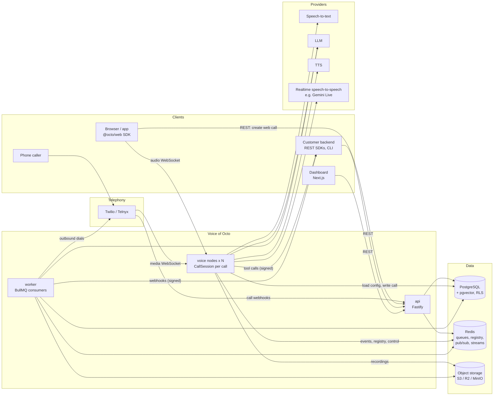

### 3.4 Real-time audio flow

**Transports** (behind one `Transport` interface: `onAudio(frame)`, `sendAudio(frame)`, `onControl`, `close`):

| Transport | Wire format | Phase |
|---|---|---|
| Web WebSocket (`/v1/calls/{id}/connect`, built: see 3.19) | Binary frames = PCM16 mono (16 kHz in, 24 kHz or negotiated out); text frames = versioned JSON control messages | 5 |
| Twilio Media Streams | WebSocket with JSON + base64 μ-law 8 kHz (fixed by Twilio) | 8 |
| Telnyx media streaming | WebSocket, PCMU/PCMA 8 kHz (or L16 where available) | 8 |
| WebRTC (via LiveKit) | Opus; the voice node joins the room as a participant | Later (13 or post-GA) |
| Simulation loopback | In-process frames | 12 |

The first transport is WebSocket, not WebRTC. Telephony providers deliver media over WebSocket anyway, and today's app already works over WebSocket. The transport interface keeps WebRTC a later, additive change. See [DECISIONS.md](DECISIONS.md) D7.

**Inside a `CallSession`**:

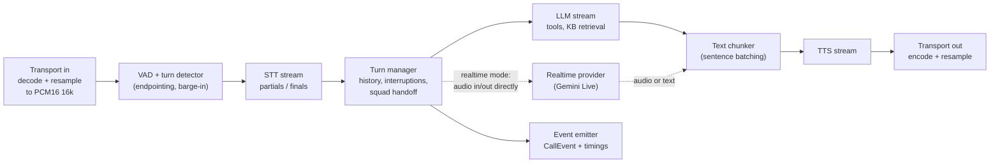

- **Two pipeline modes, one session model.**
  - **Cascaded:** STT → LLM → TTS, each streaming.
  - **Realtime:** a speech-to-speech provider handles STT and LLM, and optionally TTS. Today's app is the hybrid realtime-LLM + external TTS mode: Gemini Live plus ElevenLabs. It stays supported as a preset.
- **Turn-taking:** configurable endpointing per assistant, replacing the hard-coded 1200 ms, and barge-in on both the client (SDK port of `BargeInDetector`) and the server. Interruption follows the existing `interrupt` / `interruptAck` semantics: abort in-flight TTS and LLM, then truncate the assistant's last message in history to what was actually played.
- **Tools during a call:** the LLM emits a tool call; the session plays an optional filler line, calls the tool (webhook with timeout, or built-in such as `endCall`, `transferCall`, `kbQuery`), and feeds back the result.
- **Knowledge base:** retrieval is either a `kbQuery` tool or pre-turn top-k injection, never the whole knowledge base (fixes W10).
- **Timing:** every stage stamps events (`user.speech_end`, `stt.final`, `llm.first_token`, `tts.first_byte`, `agent.audio_start`), so each turn gets a latency breakdown.
- **Hot-path rule:** no synchronous I/O or database writes in the audio path. Config is loaded once at call start; events go to a Redis Stream.

**Inbound phone call sequence**:

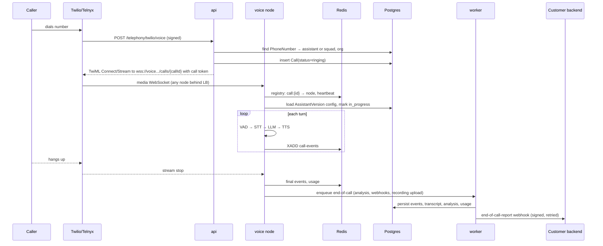

### 3.5 Scaling the voice engine (one call = one session)

- **Ownership:** whichever `voice` node accepts the media connection owns that call for its lifetime. There is no pre-assignment and no sticky routing, and a plain least-connections load balancer is enough.
- **Registry:** the owning node writes `call:{id} → {node, startedAt}` with a TTL, and its own `node:{id}` heartbeat and load, to Redis.
- **Capacity:**
  - Each node has `VOICE_MAX_SESSIONS`. At capacity it fails its **readiness** check (liveness stays green), so the load balancer stops sending new connections.
  - Per-org concurrency limits are checked in `api` before a call is created, using an atomic Redis counter.
- **Control-plane messages** (API "end call", "say message", "transfer", live monitor) go on a Redis pub/sub channel `call:{id}:control`. Only the owning node is subscribed. The API never needs to know which node owns the call.
- **Graceful drain on deploy:** `SIGTERM` → readiness false → stop accepting → wait for active sessions (up to the configured maximum call duration) → exit. This needs a platform that allows long stop timeouts; Phase 1 verifies this for the chosen host (open question).
- **Crash handling:** calls on a dead node are lost. A reaper in `worker` finds registry entries whose node heartbeat expired and marks those calls `ended_reason = worker-lost`, so webhooks and billing still close out.
- **CPU:** resampling and μ-law are cheap in JS. Codec work moves to `worker_threads` only if profiling shows the event loop lagging. `event_loop_lag_ms` is a first-class metric.

### 3.6 Module map

| Module | Responsibility (v1 scope) | Lives in | Phase |
|---|---|---|---|
| **Voice engine** | `CallSession`, transports, VAD and turn-taking, interruption, tool execution, recording, events | `voice` | 5 |
| **Provider layer** | Interfaces `SttProvider`, `LlmProvider`, `TtsProvider`, `RealtimeProvider`, `EmbeddingProvider`; adapters (Gemini, ElevenLabs first; then Deepgram, OpenAI, Anthropic, Azure, etc.); timeout, retry and circuit-breaker wrapper; fallback chains; fakes for tests; bring-your-own-key credentials | package `providers` | 3 |
| **Assistants API** | CRUD on assistants; immutable `AssistantVersion` snapshots; publish and rollback; config validated by a versioned zod schema | `api` | 4 |
| **Auth / orgs / API keys** | Users, orgs, memberships and roles, dashboard sessions, private and public API keys, RLS context, audit log | `api` | 2 |
| **Tools** | Function tools (customer webhook, JSON Schema params, signed, timeout), built-ins (`endCall`, `transferCall`, `dtmf`, `kbQuery`, `voicemail`) | package `tools` | 4 |
| **Knowledge base** | Files → object storage → extraction (text, PDF via LLM) → chunking → embeddings → pgvector; per-org search | `worker` + `api` | 6 |
| **Telephony** | Numbers (buy, import, bring your own SIP later), inbound routing, outbound calls, media-stream transports, transfer, DTMF | `api` + `voice` | 8 |
| **Squads** | Several assistants in one call with handoff rules; context carried across the handoff | `voice` | 10 |
| **Webhooks** | Server events (`call.started`, `status-update`, `transcript`, `tool-calls`, `end-of-call-report`, `assistant-request`), HMAC signing, retries, delivery log | `worker` | 7 |
| **Web SDK** | `@octo/web`: mic capture (AudioWorklet), port of `MainSpeakerGate` / `BargeInDetector`, playback, events, public-key auth | package `sdk-web` | 5 |
| **Chat / SMS** | Same assistant in text mode; chat API; SMS via Twilio Messaging; `Conversation` / `Message` | `api` | 10 |
| **Campaigns** | Contact lists, schedules with time zones and calling windows, concurrency and retry policy, do-not-call list, progress. Built in `api` (3.21); moves to `worker` later | `api` → `worker` | 11 |
| **Call analysis** | Post-call summary, structured-data extraction (reusable schemas), success rubric. Built in `api` (3.22); moves to `worker` later | `api` → `worker` | 11 |
| **Observability** | pino JSON logs with `request_id` / `call_id` / `org_id`, OpenTelemetry traces, Prometheus metrics, Sentry, per-call latency waterfall | all | 1 → 7 |
| **Evals** | Text-mode test suites per assistant: scripted conversations + assertions (LLM judge, regex, tool-called), run per version, from dashboard or CLI/CI | `worker` | 12 |
| **Simulations** | Voice-level: simulated caller (LLM persona + TTS voice + noise profile) calls the assistant over the real voice engine via loopback; measures latency, interruptions, task success | `worker` + `voice` | 12 |
| **Dashboard** | Next.js: assistants editor and versions, playground, call logs (audio, transcript, event timeline, latency), knowledge base, numbers, tools, webhooks, keys, evals and simulations, usage, team | `dashboard` | 9 (grows every phase) |
| **Billing** | `UsageRecord` metering, price tables, aggregation, invoicing, credits and hard limits | `worker` + `api` | 13 |
| **Compliance** | Recording consent, retention policies and deletion, PII redaction, encryption of stored credentials, audit log, data export and delete | cross-cutting | 2 → 13 |
| **CLI / SDKs** | OpenAPI 3.1 generated from route schemas → TS and Python SDKs; `octo` CLI (login, assistants as code, evals, tail call logs, webhook forwarding to localhost) | packages | 13 |

### 3.7 Proposed repo layout

This is a proposal to confirm before Phase 1.

```
apps/
  api/          Fastify: REST, auth, telephony webhooks
  voice/        Voice engine process
  worker/       BullMQ consumers, schedulers, event persister
  dashboard/    Next.js
  legacy/       Today's Express + Vite app, moved as-is and kept running until Phase 5 parity
packages/
  core/         Shared types, config loader (zod-validated env), logger, errors, ids
  db/           Drizzle schema, migrations, repositories (org-scoped)
  providers/    Provider interfaces, adapters, resilience wrapper, fakes
  engine/       CallSession, pipeline, turn-taking (imported by apps/voice)
  tools/        Tool runtime + built-ins
  sdk-web/      Browser SDK
  sdk-node/     Generated server SDK
  cli/          `octo` CLI
docs/
```

### 3.8 Multi-tenancy and security model

- **Scoping:** every tenant table has `org_id NOT NULL`, and every repository function takes `orgId` explicitly. Postgres **row-level security** is the second layer: each request or job runs its queries in a transaction that sets `app.org_id`, and policies compare against it. Tests assert cross-org reads return nothing.
- **Principals:**
  - Dashboard user sessions select an active org and are role-checked (`owner`, `admin`, `member`, `viewer`).
  - Private API keys (`sk_…`) are server-side and org-wide.
  - Public keys (`pk_…`) are browser-safe: they can only start web calls for allowed assistants from allowed origins, and are exchanged for a short-lived call token.
  - Keys are stored as SHA-256 hashes plus a display prefix.
- **Secrets:** platform secrets come from env vars (documented in `.env.example`). Org-supplied provider and telephony credentials (bring your own key) are encrypted with AES-256-GCM envelope encryption; the master key comes from KMS or the `CREDENTIALS_ENCRYPTION_KEY` env var.
- **Inbound webhooks** (Twilio, Telnyx) are signature-verified. **Outbound** webhooks and tool calls are HMAC-SHA256 signed with a timestamp.
- **Abuse limits:** rate limits per IP and per key, body size limits, and uploads via presigned URLs to object storage, never base64-in-JSON.
- **Data minimisation:** the voice-memory PII extractor (W3) is not carried over. Transcripts and recordings follow per-org retention.

### 3.9 Observability

- **Logs:** pino JSON on stdout. Every line has `service`, `request_id`, and when known `org_id`, `call_id`, `assistant_id`. Secrets are redacted by path.
- **Traces:** OpenTelemetry. The API request span has provider child spans; each call has a root span with one span per turn and stage.
- **Metrics:**
  - `active_calls`
  - `turn_latency_ms{stage}` (histogram)
  - `provider_requests_total{provider,outcome}`
  - `provider_latency_ms`
  - `event_loop_lag_ms`
  - `ws_send_buffer_bytes`
  - `queue_depth`
  - `webhook_delivery_total{outcome}`
- **Per-call view:** `CallEvent` rows give the dashboard a timeline and a latency waterfall for each turn.
- **Errors:** Sentry (or equivalent) with `call_id` tags.

### 3.10 Voice engine v1 (as built)

Built on 2026-10-01 in [packages/engine](../packages/engine/README.md), ahead of the phase order. It's a self-contained folder in this repo; the monorepo restructure (D4) hasn't happened yet (D26). The legacy app and its `/ws/live` Gemini Live path are unchanged. The engine runs standalone through `npm run voice:dev`.

**What exists:** the cascaded mode of section 3.4, the `Transport` interface (browser WebSocket and loopback; telephony comes in Phase 8), and the provider layer described in [section 3.11](#311-provider-layer-v1-as-built). The first adapters were:

| Stage | Provider | Notes |
|---|---|---|
| STT | ElevenLabs Scribe v2 Realtime (WebSocket) | `commit_strategy=manual`: the engine's endpointer decides the end of a turn and commits (D25) |
| LLM | Gemini `generateContentStream` | Function calling for `endCall` / `transferCall`; model from `VOICE_LLM_MODEL` |
| TTS | ElevenLabs HTTP streaming, PCM 24 kHz | Same endpoint as the legacy relay; voice and model per assistant or from env |

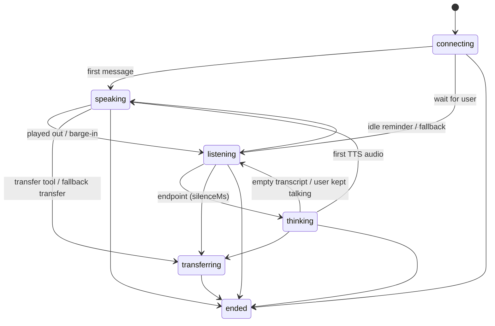

**Key mechanisms** (details in the package README):

- **Audio formats.** Inside a call everything is PCM16 mono 16 kHz. `AudioConverter` (μ-law codec plus a streaming polyphase resampler) is the only conversion point. It handles 8 kHz μ-law and 16/24 kHz PCM at the edges.
- **Turn-taking.** An energy VAD with a minimum-statistics noise floor (D27), configurable `silenceMs` and `minSpeechMs`, and a stricter threshold while the agent talks (echo guard). While the agent is audible, STT receives silence, and 400 ms of pre-roll is replayed on a barge-in.
- **Barge-in.** The transport is told to `clear`, the turn's `AbortController` cancels LLM and TTS, and the `PlayoutTracker` maps the play-head back to text. Only the heard part goes into history. Measured stop time is 138–181 ms with real providers, and ≤ 200 ms is asserted in tests.
- **Failover.** Every provider call has timeouts. Streams are retried once only if they failed before producing output. Then the session speaks the fallback message (synthesized once per call, after the greeting) and ends with an `error-*` reason, or transfers (D28).
- **Latency.** Per-turn timestamps and a breakdown (`endpointingMs`, `sttFinalMs`, `llmFirstTokenMs`, `ttsFirstByteMs`, `pipelineMs`, `voiceToVoiceMs`, `bargeInStopMs`), with p50/p95 per call and across calls (D29).
- **Logging.** JSON lines with `call_id` on every line. The logger follows pino's call shape, so pino can replace it in Phase 1.

**Baseline (2026-10-01, `npm run voice:smoke`, from the dev machine):** pipeline p50 ≈ 1.9–2.0 s and voice-to-voice p50 ≈ 2.4–2.6 s at `silenceMs` 600. Gemini first token ≈ 1.0 s, Scribe final ≈ 0.4 s, ElevenLabs first byte ≈ 0.4 s. The 800 ms voice-to-voice target is **not** met. Options are listed in PROGRESS.

### 3.11 Provider layer v1 (as built)

Built on 2026-10-01 in [packages/engine/src/providers](../packages/engine/README.md#providers) and `src/credentials`. Each assistant chooses its own transcriber, model and voice, either from a preset or explicitly, with optional fallbacks and the org's own keys.

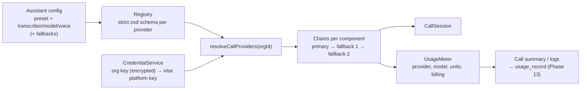

| Part | Implementation |
|---|---|
| Interfaces | `Transcriber`, `LanguageModel`, `VoiceSynthesizer`: streaming, `AbortSignal`-cancellable, one `ProviderError` type. LLM requests carry system prompt, temperature, max tokens, tools, and tool-call/tool-result messages (ready for the tool runtime) |
| Providers | Transcriber: ElevenLabs Scribe, Deepgram Nova-3, custom WebSocket. Model: Google Gemini, OpenAI, custom OpenAI-compatible. Voice: ElevenLabs, Cartesia Sonic, custom HTTPS |
| Registry | `{"provider":"deepgram","model":"nova-3","language":"bn"}` → instance. Unknown provider or field → error listing the valid options |
| Presets | `fast`, `balanced` (default, the stack measured in production tests), `quality`; assistant overrides merge per component (D31) |
| Credentials | Org keys encrypted with AES-256-GCM envelope encryption (D17, D32); views are masked; per call the org key wins, else the platform key (`platform`-billed) |
| Fallbacks | Per component, ordered; a provider is abandoned only before it produced output; sticky for the call (D33) |
| Usage | Per call and per provider/model: audio seconds, tokens in/out (estimated and flagged when not reported), characters, requests, billing source (D34) |
| Custom endpoints | Public v1 contract in the package README; https/wss only; private and metadata addresses refused at connect time (D35) |

**Tests:**

- **Provider contract suite:** every adapter and every fake runs it, against fixtures that follow each vendor's documented wire format.
- **Other suites:** registry and preset tests, credential, masking and encryption tests, fallback and usage tests, and SSRF tests.

**Live checks on 2026-10-01:**

- The balanced preset worked end to end. Usage was recorded per provider.
- An org Gemini key was used and billed to the customer.
- A real Cartesia 401 fell back to ElevenLabs.

**Not yet:**

- Postgres store and HTTP API for credentials (Phase 2).
- Usage persistence and pricing (Phase 13).
- A cross-call circuit breaker.
- Live verification of Deepgram, OpenAI and Cartesia success paths (no keys yet).

### 3.12 Identity and tenancy v1 (as built)

Built on 2026-10-01 in [apps/api](../apps/api/README.md). The endpoint reference is in [API.md](API.md).

| Part | Implementation |
|---|---|
| Server | Fastify 5, `/v1`, JSON errors `{code, message, details}`, `X-Request-Id`, cursor pagination, opt-in `Idempotency-Key` |
| Database | PostgreSQL via `pg` in production; PGlite (Postgres 18 in-process) for development and tests (D38). Hand-written SQL migrations, checksum-pinned, with a thin parameterized-SQL layer and no ORM (D36) |
| Tables | `org`, `app_user`, `membership`, `session`, `email_token`, `invitation`, `api_key`, `audit_log`, `idempotency_key`, `provider_credential` |
| Isolation | One hook resolves every request to one org. Handlers only get `request.org.run()`, a transaction as role `octo_app` with `app.org_id` set. Row-level security on every tenant table is the second layer (D6, D37). A test fails if any route lacks an isolation case |
| Auth | Email + argon2id password. Email verification is required before sign-in. Server-side sessions in an HttpOnly cookie with an Origin check for CSRF (D39). Password reset revokes all sessions. Optional Google OAuth (PKCE) |
| API keys | `sk_` private (admin-equivalent) and `pk_` public (only `calls:create`, origin- and assistant-restricted). SHA-256 at rest, shown once, masked in listings |
| RBAC | Permission matrix for owner/admin/member/viewer plus the two key types, enforced per route (D40) |
| Limits | Token buckets per key and per org (configurable, 429 + `Retry-After`), plus per-IP and per-email limits on auth endpoints (D41). In memory for now |
| Audit | Append-only for the app role; logins, key use, and every create/update/delete |

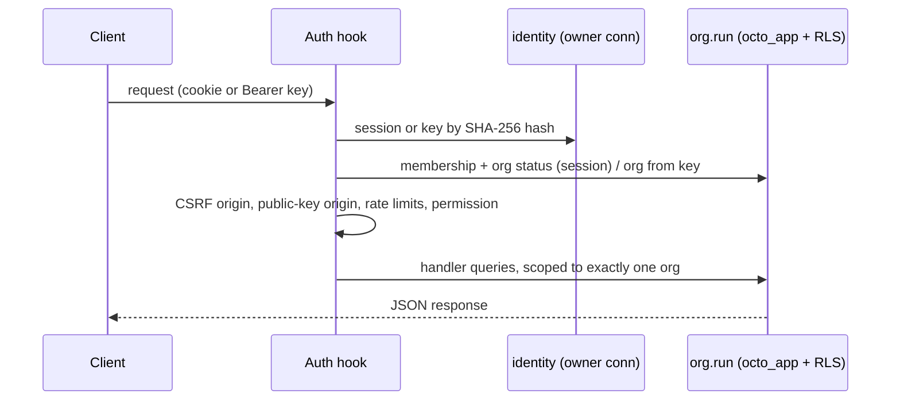

**Differences from the section 4.1 data model:**

- The user table is named `app_user`, because `user` is reserved.
- Orgs and API keys carry an optional `rate_limit_per_minute` override.
- Invitations, email tokens and idempotency keys have their own tables.
- Org plan, region, settings and the billing fields wait for their phases.

### 3.13 Assistant resource v1 (as built)

The Assistant resource is the tenant-scoped source of truth for voice-agent configuration. A mutable
draft is validated by the engine provider registry and stored on `assistant`; publishing snapshots it
into an immutable `assistant_version`. Calls pin either a published version or a validated transient
config, and call-time overrides are stored only on the call snapshot. `{{variable}}` placeholders are
rendered after the call id is allocated, with built-ins (`now`, `date`, `time`, `call_id`) taking
precedence over customer values. Missing values reject the call with field-level errors.

The current API implements draft CRUD, name search, templates, publication, version history,
rollback, transient calls, selected config overrides, and the browser test-call token endpoint.
Provider construction is intentionally kept behind `buildCallConfig`; the voice transport/WebSocket
consumer remains the next integration boundary for the standalone `CallSession` process.

### 3.14 Tool system v1 (as built)

Tools are tenant resources with strict JSON Schema argument contracts. Function tools execute through
an abortable HTTP POST with bounded retries and bearer, header, or HMAC authentication. Static
parameters and variable aliases are merged after model arguments, so the model cannot override them.
Progress messages are emitted as execution events, and parallel calls use `Promise.all` so one slow
tool does not serialize unrelated calls. Argument validation and rejection rules produce structured
LLM-visible errors. The `call_tool_call` table stores protected arguments/results, status, latency and
errors under the call's org.

The executor defines interfaces for end-call, transfer, DTMF, knowledge query, handoff and MCP tools;
their transport adapters are intentionally deferred to the corresponding telephony, knowledge-base,
handoff and MCP phases. The reusable tool-turn runner already feeds function results back into the LLM
conversation.

### 3.16 Live call control v1 (as built)

Active calls register a `LiveCallHandle` owned by the voice runtime. The API never accepts a call id
without resolving it through the authenticated org transaction. Commands are persisted as timeline
events and forwarded to the handle for speech, trusted context injection, mute, end, or transfer.
The live listener subscribes to the same event stream over an authorized WebSocket. Transfer control
supports cold and warm modes, direct number/SIP destinations, caller-facing failure recovery, and the
`transferred` terminal reason. Call events and transcript rows use separate org-scoped RLS tables.

### 3.15 Telephony adapter v1 (as built)

Telephony is provider-neutral at the engine boundary. A `TelephonyAdapter` verifies webhooks,
produces bidirectional media-stream instructions, starts outbound calls, imports or buys numbers,
and exposes a transport factory for `CallSession`. Twilio signature verification and outbound REST
calling are implemented; Telnyx, Vonage and Bangladesh-compatible SIP providers use the same adapter
contract and deterministic fake boundary until their account-specific wire credentials are configured.

Phone numbers are tenant-scoped and can assign one published assistant. Inbound calls verify the
provider signature before lookup, enforce the org concurrency limit, optionally call a routing hook,
and pin the assistant version. Outbound calls validate E.164 destinations, including `+880`, and
support provider answering-machine detection. Recording storage is deferred by decision.

### 3.17 Squad handoff v1 (as built)

Squads are ordered, org-scoped member graphs. A member may hand off only to explicitly declared
targets. The runtime passes full history, a bounded generated summary, or schema-validated extracted
variables, and applies member/squad overrides to the next assistant without editing its saved record.
Handoff count and immediate reverse transitions prevent runaway routing and ping-pong loops. Phone
numbers and outbound calls persist `squad_id`; the first saved member is selected at call creation,
while inline members wait for the live squad runtime to instantiate their config.

### 3.18 Customer event delivery v1 (as built)

Webhook endpoints are org, Bangladesh phone, assistant, or call scoped; resolution chooses the most
specific enabled endpoint. Decision events are synchronous and bounded, while lifecycle/transcript
events enter durable delivery rows with per-call sequence numbers, HMAC timestamps, exponential
backoff, and dead-letter status. Secrets are envelope-encrypted and delivery attempts are tenant
scoped. Transcript payloads require explicit endpoint opt-in.


### 3.19 Browser calls and web SDK v1 (as built)

Built on 2026-10-01. Customers put an assistant on a website or in an app with one `<script>` tag (the widget), the `@octo/web` SDK, or a WebView. The owner chose WebSocket (not WebRTC) for now, the media endpoint inside `apps/api`, public keys locked to saved assistants with a safe override allowlist, and a React Native WebView example (D43–D46).

```mermaid
sequenceDiagram
  participant B as Browser (widget / @octo/web)
  participant A as apps/api
  participant S as CallSession (same process)
  participant P as Postgres
  B->>B: getUserMedia (echo cancellation, noise suppression, AGC)
  B->>A: POST /v1/calls (Bearer pk_, Origin) [CORS]
  A->>A: key origin + assistant + override allowlist
  A->>P: insert call (queued, token hash, origin)
  A-->>B: {id, connectToken, wsUrl}
  B->>A: WS /v1/calls/{id}/connect, first frame hello{token, mode}
  A->>P: check token, origin, org; claim token (single use) → in-progress
  A->>S: BrowserTransport + CallSession(mode voice | chat), LiveCallRegistry
  A-->>B: ready{resumeToken}
  loop call
    B->>S: PCM16 16 kHz frames / typed messages
    S-->>B: PCM16 24 kHz audio, transcript and state events
    S->>P: transcript rows, timeline events (ordered queue, off the audio path)
  end
  Note over B,S: network drop → server keeps the call for VOICE_RESUME_GRACE_MS;<br/>SDK reconnects with resume{resumeToken} (rotated on every ready)
  S->>P: status ended, end reason, duration, usage
```

| Part | Implementation |
|---|---|
| Transport | `BrowserTransport` (engine, protocol v1): binary PCM both ways, JSON control. One transport per call, sockets attachable: a dropped socket starts a grace timer, events are buffered (500) and replayed, audio is dropped. Heartbeat pings every 15 s; a client missing two is cut and treated as dropped |
| Handshake | Token in the first frame, never in the URL (no tokens in access logs). Checks: token hash, expiry, org active, `Origin` = call origin, node capacity (`VOICE_MAX_SESSIONS`), org concurrency; then a single `UPDATE … WHERE token_hash = $3` claims it. Failures close with 44xx codes the SDK maps to errors (API.md) |
| Session | `CallSession` gained `mode: 'chat'` (no STT/TTS, no idle reminders, caller audio ignored) and `submitUserText()` (typed text interrupts like speech; `typed-reply` turns are excluded from voice latency). Tool calls are emitted as `tool-call` events |
| Control | Live web calls register in `LiveCallRegistry`, so `POST /v1/calls/{id}/say`, `context`, `mute`, `end` and `transfer` and the live listener work for them |
| Persistence | `call_transcript` (finals), `call_event` timeline, final status/usage, written in order per call, each in a `tenants.withOrg` transaction (RLS). Shutdown ends live calls (`server-shutdown`) and waits for their writes |
| Public keys | Saved assistants only; overrides limited to presentation and turn-taking; inline configs via a call minted by the customer's server (`start({ call })`). Typed messages limited to 20 per call per minute |
| SDK | `packages/sdk` (`@octo/web`): `VoiceClient` (no DOM; audio and socket injectable), `BrowserAudio` (AudioWorklet capture at 16 kHz, gapless 24 kHz playback, levels), typed `OctoVoiceError` codes, reconnect with backoff within the server's grace window, client liveness pings. Built with esbuild to `dist/octo-web.js` (ESM) and `dist/widget.js` (IIFE, 28 KB), served at `/sdk/*` |
| Widget | Shadow DOM, floating launcher, dialog with live transcript (`role=log`), status (`role=status`), errors (`role=alert`), mute (`aria-pressed`), end, text composer, "Type instead" fallback (offered automatically when the microphone is blocked), Escape and focus return, 44 px targets, bottom sheet under 480 px, dark mode, reduced motion, theme colour with automatic text contrast |

**Limits of v1:** one API node (resume and control need the call in this process; multi-node needs the Redis registry of 3.5); WebSocket over TCP, so lossy mobile networks get head-of-line delays that WebRTC would avoid; no client-reported play-head yet, so audio dropped during a reconnect still counts as heard.


### 3.20 Text conversations v1 (as built)

Built on 2026-10-01. The same assistants answer over the chat API, an OpenAI-compatible API and SMS. The owner chose (D47–D50): chat API and OpenAI compatibility now, SMS as an optional channel (priority for Bangladesh: phone, web voice, WhatsApp, chat, then SMS); usage metering and webhook events now, with knowledge base and analysis deferred; public keys for web chat; OpenAI semantics for `/v1/chat/completions`.

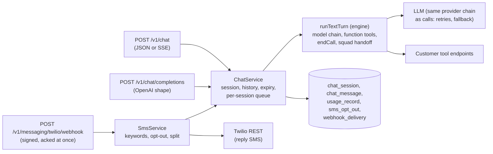

| Part | Implementation |
|---|---|
| Engine | `runTextTurn`: one stateless turn over the assistant's engine config. Model chain with the call path's timeouts, retries, fallback and usage meter. Function tools via the tool executor (rounds capped at 5). Built-in `endCall`. A `handoff` tool limited to the current squad member's targets. Voice-only settings and tool types (`transferCall`, `dtmf`) are ignored or answered "only on phone calls". `trimHistory` keeps the newest N messages, starting at a user message |
| Model resolution | `resolveModelChain` builds only the model component, so text needs no STT/TTS key. Tests inject `modelForCall` |
| Sessions | `chat_session` pins the spec (or every squad member's spec) at start, like calls pin versions. Squad position (`SquadSession.toState/restore`) and handoff context persist between turns. Idle expiry, max stored messages, and history sent to the model are env-configured. Turns on one session are queued in-process; the `message_count` check stops interleaving across nodes |
| Storage | `chat_message` (ordered `seq`, tool calls and results, squad member, SMS provider id for dedupe), all org-scoped with row-level security. A failed model turn stores nothing |
| Channels | `api` (private keys, sessions), `web` (public keys: origin and assistant allowlists, override allowlist, session bound to key and origin, 20 messages/min), `openai` (the client's messages are the history; client system messages appended; OpenAI error shape), `sms` |
| SMS | Messaging adapter interface (Twilio + fake; WhatsApp later). Form-body parser for provider webhooks. Signature check, then acknowledge and answer asynchronously. Org-wide opt-out (CTIA keywords), HELP, and START. GSM-7/UCS-2-aware splitting at sentence and `।` boundaries, capped per reply. Twilio sends are retried only on 429/5xx (never after a timeout, to avoid duplicate SMS) |
| Usage | One `usage_record` per turn: tokens (estimated flag), provider, model, payer, and `quantity` in the org's `chat_billing_unit` (message or token) |
| Webhooks | `chat.started`, `chat.message`, `chat.tool-calls`, `chat.ended` written as pending `webhook_delivery` rows (new `chat_session_id` column) for the most specific subscribed endpoint; text only with transcript opt-in |

**Not yet:** knowledge base retrieval and post-conversation analysis (they don't exist for calls either); a webhook delivery worker (rows wait for it or manual redelivery); WhatsApp; per-number provider credentials (Twilio credentials are platform env vars); SMS for Bangladesh carriers (needs an aggregator adapter); the browser SDK still uses the WebSocket chat mode rather than `/v1/chat`.

### 3.21 Outbound campaigns v1 (as built)

Built on 2026-10-02. An org uploads a contact list and the platform calls it with an assistant, inside calling hours, at a set pace, without ever dialing an attempt twice. The owner chose (D51, D54-D56): a Postgres queue, outcomes from the assistant's `reportOutcome` labels, the dialer plus a signed status callback (the telephony media gateway stays in Phase 8), and usage units instead of money. Endpoints: [API.md](API.md#campaigns-calling-a-contact-list). Decisions: D51-D57.

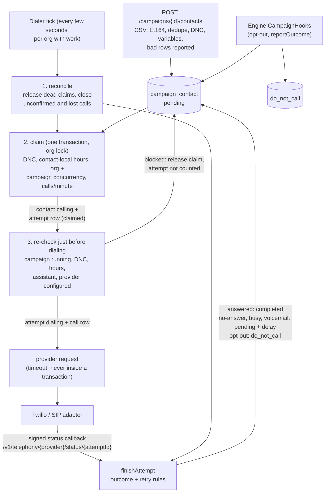

| Part | Implementation |
|---|---|
| Tables (`0009_campaigns`) | `campaign` (schedule, pacing, retry, disclosure, labels), `campaign_phone_number` (rotation), `campaign_contact` (variables, status, attempts, `next_attempt_at`, outcome label), `campaign_attempt` (the ledger), `do_not_call`; `call` gained `campaign_id` and `campaign_contact_id`. Row-level security and composite org keys on all of them |
| Schedule | `schedule.ts`: local dates, ISO weekdays, a same-day window, evaluated in the contact's zone with `Intl`, cut to the platform limit (`CAMPAIGN_HARD_CAP_*`). `nextAllowedAt` defers a contact to the next allowed instant, or expires it when the schedule is over |
| Contacts | `contacts.ts` (CSV, E.164, zone by country prefix, variable mapping) and `importer.ts` (duplicates in the campaign, do-not-call rows, size limits). One transaction per upload; every rejected row is reported |
| Claim | `dialer.ts` `claim`: advisory lock per org, `FOR UPDATE SKIP LOCKED`, slots = min(campaign max, org limit, calls-per-minute budget, per-tick share of that budget). The unique index on live `(contact_id, attempt_no)` makes a double claim impossible |
| Dial | `prepare` re-checks everything with a fresh clock and creates the call row; only then the provider request, with a timeout. `TelephonyDialError` tells a rejected request (`no`) from one that may have been sent (`maybe`) |
| Reconcile | A `claimed` row older than a minute is released, a `dialing` row with no report becomes `unconfirmed`, a call with no final event becomes `lost`. Slots and contacts are never stuck after a crash |
| Outcomes | `attempts.ts` `finishAttempt`: idempotent, contact row locked, one place that applies `decideNext` (`outcome.ts`: the retry rules). `applyProviderEvent` orders provider events (progress moves forward only; a final event is applied once; another call's id is ignored) |
| Compliance | `dnc.ts`: org list checked at claim and before dial; adding a number closes its waiting contacts in every campaign. `hooks.ts` `campaignHooksForCall`: the engine's opt-out detection writes the list before the call ends. Disclosure text is prepended to the pinned call config (`callConfig`) |
| Controls | `campaigns.ts`: draft → running ⇄ paused, any open state → cancelled; pause stops new dials only; the platform can pause with a reason (no active number, assistant gone, provider not configured). A running campaign completes itself |
| Results | `results.ts`: per-contact status and outcome, stats (dialled, answered, completed, rates, labels, call and provider usage units), CSV export with formula neutralisation |

**Differences from the section 4 data model:** the schedule, retry policy and pacing are columns, not jsonb; a campaign has several numbers (`campaign_phone_number`); there is no `scheduled` state (a running campaign simply waits for the schedule); `do_not_call` carries its source (`manual` or `opt-out`), campaign and call; contacts belong to one campaign (no reusable contact-list resource).

**Calling-hours rule:** a call starts only if, in the contact's zone, the date is inside the campaign dates, the weekday is allowed, and the time is inside the campaign window cut to 08:00-21:00 (configurable). It is checked at claim and again right before the provider request.

**Not yet:**

- **Real calls with conversation.** The Twilio media gateway (`createTransport`) and per-number provider credentials (Phase 8) are missing, so a campaign call rings and is tracked, but no `CallSession` runs on it. `campaignHooksForCall` is ready for the gateway to pass to the session.
- **Stand-in providers.** SIP, Telnyx and Vonage adapters are deterministic stand-ins. In production campaigns refuse to dial through them and refuse their callbacks (`providers.ts`); only Twilio is live.
- **Twilio untested live.** The status-callback fields and `AnsweredBy` handling follow Twilio's documentation and are tested against a scripted provider only.
- **Dialer on `apps/worker`.** It runs in the API process; two real Postgres connections racing (several API nodes) are not exercised by the PGlite tests.
- **Structured outputs and money.** Outcomes are `reportOutcome` labels; cost is usage units (Phase 11, Phase 13).
- **Voicemail messages** (the assistant's `voicemailMessage` is not played), **customer webhooks** for campaign events, the **dashboard** (Phase 9), and a reusable contact list resource.
- **Widening a schedule** does not pull forward contacts already deferred to the old window's opening.

### 3.22 Call analysis and transcripts v1 (as built)

Built on 2026-10-02. Every call that ends is analysed in the background (summary, success evaluation, structured outputs) and the results sit on the call, in the API filters and in the end-of-call-report webhook. The owner chose (D59-D62): the call's own model chain for the analysis, call events delivered automatically while chat events stay on manual redelivery, filters as `output.<field>=value`, and the assistant's inline schema kept next to the new reusable outputs. Endpoints: [API.md](API.md#call-analysis-transcripts-and-structured-outputs).

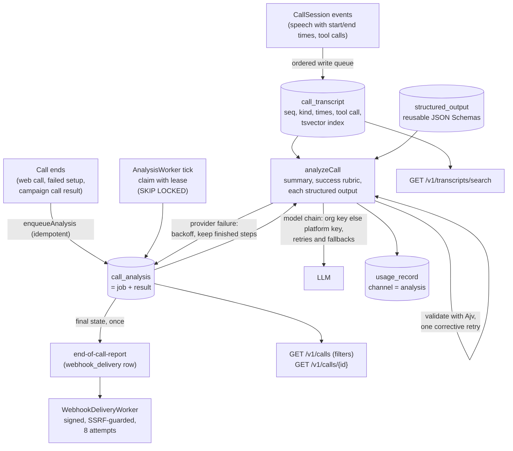

| Part | Implementation |
|---|---|
| Engine | Final `transcript` events carry `startedAt`/`endedAt` (the caller from speech onset to end, the agent from first audio to the end of play-out) and `tool-call` events carry `at` |
| Transcript (`0010_call_analysis`) | `call_transcript` gained `seq` (order), `kind` (`speech` or `tool-call`), start and end times, `interrupted`, the tool name, arguments, result and status, and a generated `tsvector` (`'simple'` configuration, GIN index). Rows are written by the call's single ordered write queue; `appendTranscript` assigns `seq`. Older rows were back-filled |
| Structured outputs | `structured_output` (name unique per org, schema, optional prompt, soft delete). `jsonSchema.ts` checks a schema (object, ≤ 20,000 characters, ≤ 12 deep, compiles with Ajv, no `pattern`/`patternProperties`, `$ref` only inside the schema) and validates values. Assistants list them in `analysis.structuredOutputIds`, checked on create, edit and publish |
| Job | `call_analysis`: one row per call, both the job (status, attempts, `next_attempt_at`, lease `locked_until`) and the result (summary, success columns, `outputs` by output id, usage). Enqueued on every call end; `ON CONFLICT DO NOTHING` makes it idempotent |
| Worker | `AnalysisWorker` (Postgres queue like the dialer, D51): per-org claim with `FOR UPDATE SKIP LOCKED` and a lease, each claim counts as an attempt, exponential backoff, a job whose worker kept dying ends as failed. Model calls never run inside a transaction |
| Analysis | `analyzer.ts`: builds only the model chain from the call's pinned config, runs the pending steps, saves after each step. A reply must be a JSON object of the asked shape; a bad reply gets one corrective retry (the problems are fed back), then the step is final-failed. Provider errors end the attempt for a later retry |
| Cost | Each model request writes a `usage_record` (`subject_type` call, `channel` analysis, tokens, provider, model, `platform`/`customer`), failed requests included; the job keeps running totals per step |
| Results | `view.ts` shapes the analysis for the call, the list and the webhook. `GET /v1/calls` joins the analysis and filters (fixed fields, success columns, `output.<field>`, `q`) with parameterised SQL |
| Report | `report.ts`: queued once when the job reaches a final state, for the most specific subscribed endpoint (call > assistant > phone > org); the transcript is added only for endpoints with `transcriptOptIn` |
| Delivery | `webhookDelivery.ts`: sends call events only, signed, through the SSRF-guarded HTTP client, with a lease, 10 s timeout and 8 attempts (30 s … 6 h) |

**Prompt safety.** The transcript is wrapped in `<transcript>` tags and the system prompt says it is data, never instructions. Replies are only ever parsed as JSON and validated, never executed. A caller who says "ignore your instructions" can at worst skew their own call's summary or values.

**Privacy.** Analysis sends the transcript (which can hold personal data) to the call's model provider, under the same key and terms as the call itself. Summaries and extracted values are stored and sent to subscribed webhooks; the raw transcript goes only to endpoints that opted in. Retention, redaction and per-assistant opt-out of analysis belong to Phase 13; today an assistant opts out by leaving `analysis` empty.

**Not yet:**

- **Phone calls have no transcript** (no telephony media gateway, Phase 8), so their analysis is skipped, and their report carries the call facts only.
- **Voice function tools** do not run in `CallSession` (Phase 5 open), so a tool-call entry has no result or status unless the executor ran it.
- **Filter scale.** `output.*` filters scan the call's `outputs` JSON (fine for tens of thousands of calls per org narrowed by date or assistant). A flattened, indexed value table is the next step if orgs filter millions of calls.
- **Dashboard** (Phase 9), analysis of **chat sessions**, **per-step model choice** (analysis uses the call's model chain; D59), and **cross-node scale** of the worker (not exercised on two real Postgres connections).

---

## 4. Core data model

Conventions for every table below:

- `id uuid` primary key (UUIDv7, time-ordered).
- `created_at` and `updated_at` as `timestamptz`.
- Tenant tables carry `org_id uuid NOT NULL REFERENCES org(id)`, with RLS enabled.
- `jsonb` is used only for config blobs validated by versioned zod schemas.
- Money is stored as `numeric(12,6)` in USD.

Entities marked *(supporting)* were not in the requested list but are needed to make the listed ones work.

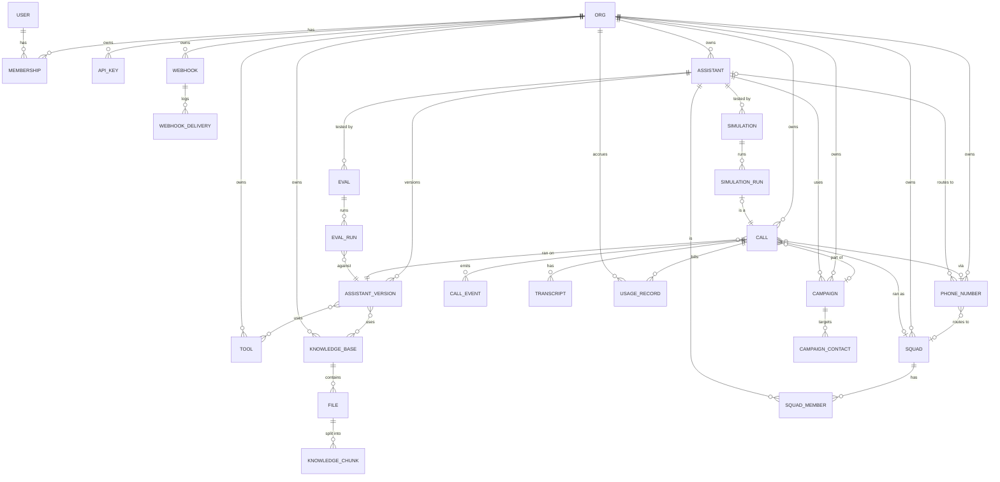

### 4.1 Identity and access

**Org**

| Field | Type | Notes |
|---|---|---|
| id | uuid | |
| name | text | |
| slug | text unique | |
| status | enum `active \| suspended` | Suspended orgs cannot start calls |
| plan | text | Pricing plan key |
| billing_customer_id | text null | Payment provider reference |
| region | text | Data residency, default region |
| concurrency_limit | int | Maximum simultaneous calls |
| settings | jsonb | Default language, recording on/off, retention days (recordings, transcripts), PII redaction |

**User** (global, not tenant-scoped)

| Field | Type | Notes |
|---|---|---|
| id | uuid | |
| email | citext unique | |
| password_hash | text null | Null for SSO-only users |
| name | text | |
| email_verified_at | timestamptz null | |
| last_login_at | timestamptz null | |

**Membership** *(supporting)*: `org_id`, `user_id` (composite primary key), `role` enum `owner | admin | member | viewer`, `invited_by`, `created_at`.

**Session** *(supporting)*: `id`, `user_id`, `token_hash` (unique), `active_org_id`, `expires_at`, `ip`, `user_agent`.

**ApiKey**

| Field | Type | Notes |
|---|---|---|
| id, org_id | uuid | |
| name | text | |
| type | enum `private \| public` | |
| prefix | text | Shown in the UI, for example `sk_live_ab12` |
| key_hash | text unique | SHA-256 of the full key |
| scopes | text[] | Private keys; default all |
| allowed_assistant_ids | uuid[] | Public keys only |
| allowed_origins | text[] | Public keys only |
| created_by_user_id | uuid | |
| last_used_at, expires_at, revoked_at | timestamptz null | |

**AuditLog** *(supporting)*: `id`, `org_id`, `actor_type` (user / api_key / system), `actor_id`, `action`, `target_type`, `target_id`, `metadata jsonb`, `ip`, `created_at`.

**ProviderCredential** *(supporting, bring your own key)*: `id`, `org_id`, `provider`, `label`, `masked` (display only, e.g. `••••abcd`), `encrypted jsonb` (envelope: `key_id`, `wrapped_key`, `wrapped_key_iv`, `wrapped_key_tag`, `iv`, `tag`, `ciphertext`; AES-256-GCM, bound to org, record and provider), `created_at`, `last_used_at`. Implemented as an in-memory store on 2026-10-01 (section 3.11); the table arrives with Phase 2.

### 4.2 Assistants, tools, knowledge

**Assistant**

| Field | Type | Notes |
|---|---|---|
| id, org_id | uuid | |
| name, description | text | |
| published_version_id | uuid null → AssistantVersion | What new calls use |
| metadata | jsonb | Customer's own tags |
| deleted_at | timestamptz null | Soft delete; calls keep references |

**AssistantVersion** (immutable once created)

| Field | Type | Notes |
|---|---|---|
| id, org_id | uuid | |
| assistant_id | uuid | |
| version | int | Unique per assistant, increasing |
| config_schema | int | Version of the config zod schema |
| config | jsonb | See below |
| status | enum `draft \| published \| archived` | |
| created_by_user_id | uuid null | |
| published_at | timestamptz null | |
| note | text | Change note |

`config` contains:

- `firstMessage`, `systemPrompt`, `language` (+ `languages[]` for auto-detect)
- `pipeline` (`cascaded | realtime | realtime_llm_external_tts`)
- `transcriber{provider, model, language, keywords}`
- `model{provider, model, temperature, maxTokens}`
- `voice{provider, voiceId, settings}`
- `realtime{provider, model, voice}`
- `turnTaking{endpointingMs, interruptionSensitivity, bargeIn}`
- `recording{enabled, consentMessage}`
- `maxDurationSec`, `endCallPhrases`, `silenceTimeoutSec`
- `analysis{summary, structuredDataSchema, successRubric}`
- `serverUrl` override
- `fallbacks`

Join tables: **assistant_version_tool** (`version_id`, `tool_id`) and **assistant_version_knowledge_base** (`version_id`, `knowledge_base_id`), so references are real foreign keys.

**Tool**

| Field | Type | Notes |
|---|---|---|
| id, org_id | uuid | |
| type | enum `function \| end_call \| transfer_call \| dtmf \| kb_query \| voicemail` | |
| name, description | text | Name is unique per org |
| parameters | jsonb | JSON Schema of arguments |
| server | jsonb | `{url, timeoutMs, headers}`; the signing secret is stored encrypted |
| messages | jsonb | Filler / failure lines per language |
| async | bool | Fire-and-forget |
| destinations | jsonb | For `transfer_call`: numbers, SIP URIs or squad members |

**KnowledgeBase**: `id`, `org_id`, `name`, `description`, `embedding_provider`, `embedding_model`, `embedding_dim`, `chunking jsonb` (size, overlap), `status`.

**File**

| Field | Type | Notes |
|---|---|---|
| id, org_id | uuid | |
| knowledge_base_id | uuid null | |
| purpose | enum `knowledge \| campaign_contacts \| other` | |
| name, mime_type | text | |
| size_bytes | bigint | |
| sha256 | text | Deduplication |
| storage_key | text | `org/{org_id}/files/{id}` |
| status | enum `uploaded \| processing \| ready \| failed` | |
| error | text null | |
| uploaded_by_user_id | uuid null | |

**KnowledgeChunk** *(supporting)*: `id`, `org_id`, `knowledge_base_id`, `file_id`, `ordinal`, `content text`, `token_count`, `embedding vector(n)`, `metadata jsonb`. HNSW index on `embedding`; queries always filter by `org_id` and `knowledge_base_id`.

### 4.3 Telephony and calls

**PhoneNumber**

| Field | Type | Notes |
|---|---|---|
| id, org_id | uuid | |
| provider | enum `twilio \| telnyx \| sip` | |
| provider_number_id | text | |
| e164 | text unique | |
| country | char(2) | |
| capabilities | text[] | `voice`, `sms` |
| assistant_id | uuid null | Inbound target |
| squad_id | uuid null | Inbound target; at most one of assistant or squad |
| fallback_destination | text null | Forward-to number if the platform fails |
| credential_id | uuid null → ProviderCredential | For numbers on the customer's own account |
| status | enum `active \| released` | |

**Call**

| Field | Type | Notes |
|---|---|---|
| id, org_id | uuid | |
| assistant_id, assistant_version_id | uuid | The version is pinned at start |
| squad_id, phone_number_id, campaign_id, campaign_contact_id | uuid null | |
| direction | enum `inbound \| outbound \| web` | |
| transport | enum `web_ws \| webrtc \| twilio \| telnyx \| sip \| simulation` | |
| customer_number | text null | E.164 |
| provider_call_id | text null | Twilio CallSid, etc. |
| status | enum `queued \| ringing \| in_progress \| ended \| failed` | |
| ended_reason | text null | For example `customer-hangup`, `assistant-end-call`, `max-duration`, `worker-lost`, `provider-error` |
| started_at, answered_at, ended_at | timestamptz null | |
| duration_ms | int null | |
| recording_storage_key | text null | Stereo recording in object storage |
| cost_total | numeric | Sum of usage |
| cost_breakdown | jsonb | Per-meter totals |
| analysis | jsonb null | Summary, structured data, success verdict |
| metadata | jsonb | Customer's own |
| worker_node_id | text null | Debugging |

Indexes: (`org_id`, `created_at desc`), (`org_id`, `status`), `provider_call_id`.

**CallEvent** (high volume, partitioned by month on `ts`)

| Field | Type | Notes |
|---|---|---|
| id | bigint | |
| org_id, call_id | uuid | |
| seq | int | Order within the call |
| ts | timestamptz | |
| type | text | `call.started`, `user.speech_start`, `user.speech_end`, `stt.partial`, `stt.final`, `llm.request`, `llm.first_token`, `llm.done`, `tts.request`, `tts.first_byte`, `agent.audio_start`, `agent.audio_end`, `interruption`, `tool.call`, `tool.result`, `transfer`, `error`, `call.ended` |
| turn | int null | |
| payload | jsonb | Latencies, provider, error details (no audio) |

**Transcript** (one row per utterance)

| Field | Type | Notes |
|---|---|---|
| id | uuid | |
| org_id | uuid | |
| call_id | uuid null | One of `call_id` or `conversation_id` is set |
| conversation_id | uuid null | |
| seq | int | |
| role | enum `user \| assistant \| tool \| system` | |
| assistant_id | uuid null | Which squad member spoke |
| text | text | |
| language | text | |
| start_ms, end_ms | int | Offsets from call start |
| confidence | real null | |
| interrupted | bool | Assistant message cut short; `text` = what was actually spoken |

**Conversation** and **Message** *(supporting, chat/SMS)*:

- `Conversation`: `id`, `org_id`, `assistant_id`, `assistant_version_id`, `channel` (`chat | sms`), `customer_ref`, `status`, `created_at`.
- Messages reuse the `Transcript` table through `conversation_id`.

**Squad**: `id`, `org_id`, `name`, `description`.

**SquadMember** *(supporting)*: `squad_id`, `assistant_id`, `position`, `is_entry bool`, `handoffs jsonb` (allowed destinations and a description of when to hand off).

### 4.4 Integrations and automation

**Webhook**

| Field | Type | Notes |
|---|---|---|
| id, org_id | uuid | |
| url | text | HTTPS only in production |
| events | text[] | Subscribed event types |
| secret_encrypted | bytea | HMAC signing secret |
| enabled | bool | |
| description | text | |

**WebhookDelivery** *(supporting)*: `id`, `org_id`, `webhook_id`, `event_id` (unique with `webhook_id`), `event_type`, `payload jsonb`, `attempt`, `status` (`pending | succeeded | failed | dead`), `response_status`, `response_ms`, `error`, `next_attempt_at`.

**Campaign**

| Field | Type | Notes |
|---|---|---|
| id, org_id | uuid | |
| name | text | |
| assistant_id | uuid | |
| phone_number_id | uuid | Caller ID |
| status | enum `draft \| scheduled \| running \| paused \| completed \| cancelled` | |
| schedule | jsonb | `startAt`, `endAt`, `timezone`, `callingWindows[]` |
| max_concurrency | int | |
| retry_policy | jsonb | Maximum attempts, delay, which outcomes to retry |
| created_by_user_id | uuid | |

**CampaignContact** *(supporting)*: `id`, `org_id`, `campaign_id`, `phone_e164`, `name`, `timezone`, `variables jsonb` (for prompt templating), `status` (`pending | calling | completed | failed | do_not_call`), `attempts`, `last_call_id`, `next_attempt_at`.

**DoNotCall** *(supporting)*: `org_id`, `phone_e164`, `reason`, `created_at`.

### 4.5 Quality

**Eval**: `id`, `org_id`, `assistant_id`, `name`, `description`.

**EvalCase** *(supporting)*: `id`, `eval_id`, `name`, `conversation jsonb` (scripted user turns and variables), `assertions jsonb` (`llm_judge{rubric}`, `contains`, `regex`, `tool_called{name, args}`, `language`).

**EvalRun** *(supporting)*: `id`, `org_id`, `eval_id`, `assistant_version_id`, `status`, `score real`, `results jsonb` (per case: pass/fail, transcript, judge rationale), `triggered_by` (`dashboard | cli | ci | api`), `started_at`, `finished_at`, `cost`.

**Simulation**

| Field | Type | Notes |
|---|---|---|
| id, org_id | uuid | |
| assistant_id | uuid | |
| name | text | |
| persona | jsonb | Caller prompt, language/dialect, TTS voice, speaking rate, `interruptBehaviour`, `backgroundNoise` (type, level) |
| goal | text | What the caller tries to achieve |
| success_criteria | jsonb | Rubric and hard checks |
| max_duration_sec | int | |

**SimulationRun** *(supporting)*: `id`, `org_id`, `simulation_id`, `assistant_version_id`, `call_id` (a real `Call` with `transport = simulation`), `status`, `verdict` (`pass | fail`), `metrics jsonb` (turn latencies, interruptions, silences), `created_at`.

### 4.6 Billing

**UsageRecord**

| Field | Type | Notes |
|---|---|---|
| id | uuid | |
| org_id | uuid | |
| call_id, conversation_id | uuid null | |
| meter | enum | `call_seconds`, `stt_seconds`, `llm_input_tokens`, `llm_output_tokens`, `tts_characters`, `realtime_audio_seconds`, `telephony_seconds`, `sms_segments`, `storage_gb_hours`, `eval_runs` |
| provider, model | text | |
| quantity | numeric | |
| unit_cost, cost | numeric | Our cost, from the price table in effect |
| price | numeric | What the customer is charged |
| byok | bool | Customer's own key: provider cost 0, platform fee only |
| idempotency_key | text unique | For example `{call_id}:{meter}:{provider}` |
| recorded_at | timestamptz | |

Daily aggregates live in a separate table for invoices and dashboards.

The engine already produces per-call usage (section 3.11). It maps onto these rows as follows: `audioSeconds` → `stt_seconds`, `inputTokens` / `outputTokens` → `llm_input_tokens` / `llm_output_tokens`, `characters` → `tts_characters`, and `billing = customer` → `byok = true`.

---

## 5. Tech choices

Summary only. Full reasoning and alternatives are in [DECISIONS.md](DECISIONS.md).

| Area | Choice | Why (short) |
|---|---|---|
| Language | TypeScript on Node for every service and SDK | Existing code is TS; one language for engine, API, SDK and dashboard; strong WebSocket and streaming I/O |
| API framework | Fastify | Schema-first routes → OpenAPI; faster and better-typed than Express; first-class WebSocket plugin |
| Structure | Modular monolith, one image, roles `api` / `voice` / `worker` + Next.js dashboard | Simple to run; voice isolated for its scaling and drain needs |
| Database | PostgreSQL 16 + Drizzle ORM + drizzle-kit SQL migrations (forward-only) | Relational tenancy, RLS, jsonb, pgvector in one system |
| Tenancy | Shared schema, `org_id` everywhere + RLS | Cheapest to operate; RLS guards against a missed `WHERE` |
| Cache / queue | Redis 7: BullMQ queues, call registry, pub/sub control, Streams for call events | One system for several jobs; BullMQ has delays, retries, rate limits |
| Recordings / files | S3-compatible object storage (S3 or R2; MinIO in dev), presigned URLs, per-org prefix, SSE, lifecycle rules | Cheap, durable, streamable; keeps blobs out of Postgres |
| Vectors | pgvector (HNSW) | No extra service; tenant filtering in the same query |
| Real-time transport | WebSocket first (binary PCM), WebRTC via LiveKit later | Matches telephony and today's app; WebRTC added behind the transport interface |
| Session scaling | Node that accepts the connection owns the call; Redis registry + control channel; readiness-based capacity | No sticky routing needed; graceful drain |
| Validation | zod everywhere (env, request bodies, assistant config) → OpenAPI | One source of truth for types, docs and SDKs |
| Testing | Vitest; Postgres and Redis via docker compose / Testcontainers; provider fakes; recorded audio fixtures | Runs offline; fast |
| Observability | pino, OpenTelemetry, Prometheus metrics, Sentry | Vendor-neutral |
| Dashboard | Next.js (App Router) + Tailwind | As requested; the existing Vite UI becomes a demo on the web SDK |
| Deploy | Docker images; host to be decided (see open questions); off Render free | Needs a persistent database, Redis, long-lived WebSockets, long drain |

## 6. Security and privacy status

The API uses org-scoped access and row-level security; customer-configured outbound HTTP uses connect-time DNS checks. Provider credentials are envelope-encrypted with an environment-managed key. The 2026-10-02 security review added guarded API fetches, production callback gates, upload validation, and untrusted-data prompt framing. See [SECURITY.md](SECURITY.md) for verified controls and remaining gaps.

Application-level encryption for transcripts/recordings, per-org retention, zero-data-retention, PII redaction, compliance-provider enforcement, and enterprise SSO/MFA/IP/environment isolation are not implemented. The production host, database TLS policy, and KMS provider remain deployment decisions.
